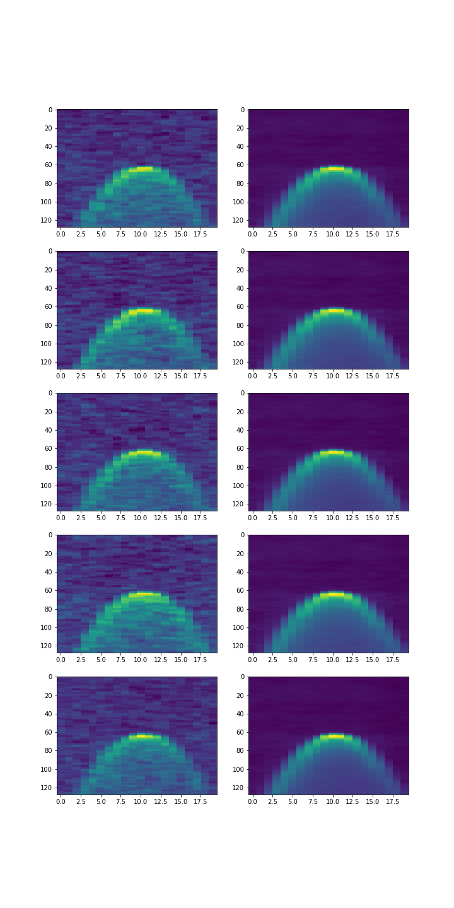
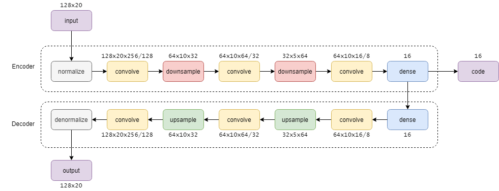

# DDM Autoencoder

The Delay Doppler Map (DDM) Autoencoder is a deep learning algorithm that aims to compress and decompress spatial image data while retain as much of the information as necessary.

## Files

- **ddmautoencoder.py:** the main file that is used to run the autoencoder. This will create 4 files in the same directory:
	- `model_weights.h5`: a file with each of the optimized parameter weights saved in it
	- `History.mat`: a dictionary file compatible with MATLAB with the error losses for the training set and test set over epochs
	- `DDMextract.mat`: a dictionary file compatible with MATLAB with the decompressed DDM data saved
	- `output.png`: a side-by-side comparison between the input and extracted images
- **model_weights.h5:** the pre-trained model weights
-  **DDMtrain.mat:** a matlab file containing 5000+ samples of anomaly filtered DDMs for training the autoencoder
- **DDMtest.mat:** a matlab file containing the test set for the autoencoder
- **ExtractDDM.m:** a matlab script to convert the `DDM.nc` file into a workable dataset
- **requirements.txt:** a list of python libraries used for the autoencoder

## Usage
#### Default settings
1. Run `python ddmautoencoder.py` in command line
	>1. Make sure you have the necessary libraries specified in `requirements.txt`, otherwise, run the following in your command line `pip install -r requirements.txt`
	>2. Make sure you have the files mentioned in the 'Files' section in the same directory as `ddmautoencoder.py`
	
#### Custom settings
1. **Create custom DDM dataset**
	a. The [MERRByS](merrbys.co.uk/)  website hosts a large collection of publically available L1b data. The data can be simply but slowly downloaded after registering a user account.
	b. One of the satellite engineers and researcher Philip Jales has a [repository](github.com/pjalesSSTL/GNSSR_MERRByS) for processing the raw data downloaded from the MERRByS website
	c. `ExtractDDM.m` is a custom script that extracts exclusively the DDM data from the `ddms.nc` and saves them into a matrix dataset `DDMtrain.mat`

## Output

    

## Components

    

